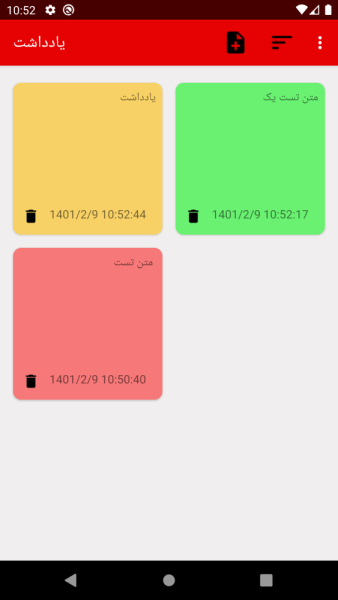
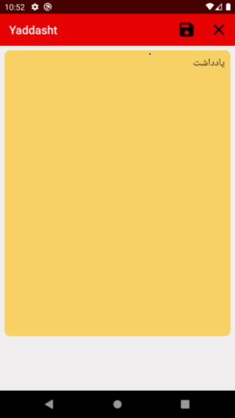

# Yaddasht

In this project i am create a note manager application for write and save notes in different categories that indicate by its color
and save Persian date time for every notes. and you can delete notes if you want.
You can sort your notes by its color or dateTime

## in this project :

1- Use Room ORM for working database
2- ActionBar menu and action views
3- AlertDialog with selection items
4- RecyclerView for show note list
5- CustomToast View for toast

This project write in Kotlin

## Images :

### Home :

### Edit :

### Select color on save :
